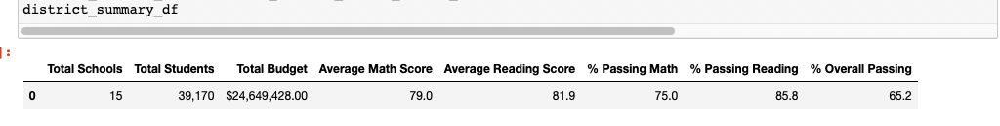
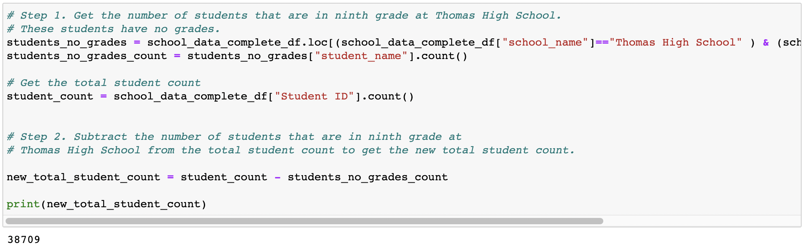
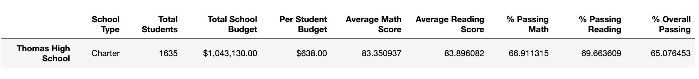
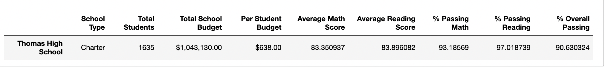
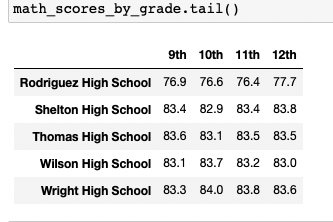
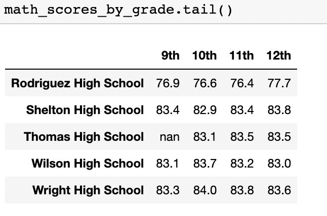
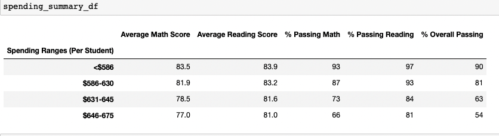
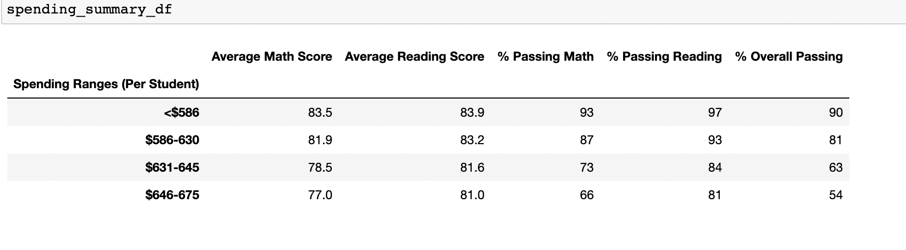
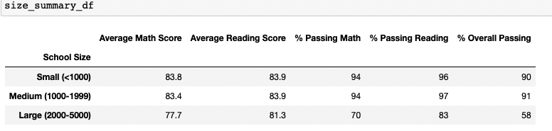
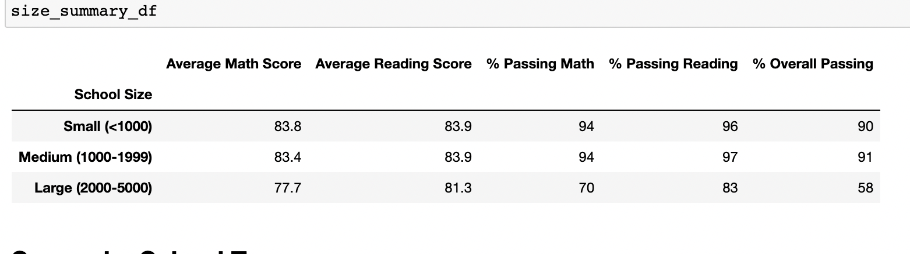

# School_District_Analysis

## Overview of the school district analysis:

We were given access to each student's math and reading scores in this module, along with various details about the school they attend, and our task was to compile the data and highlight trends in academic performance. The school board and superintendent could use this information to help them decide on the budget and other priorities for the schools.
After we performed the analysis school board has notified us that the students_complete.csv file shows evidence of academic dishonesty; specifically, reading and math grades for Thomas High School ninth graders appear to have been altered. Although the school board does not know the full extent of the academic dishonesty, they want to uphold state-testing standards and asked us for help. We need to replace the math and reading scores for Thomas High School with NaNs while keeping the rest of the data intact. Once we've replaced the math and reading scores, we need to repeat the school district analysis that we did in this module and write up a report to describe how these changes affected the overall analysis.

## Results:
### District summary results
The original DataFrame which we did in the Module looks like the following image:

After we replaced the math and reading scores for Thomas High School 9th graders with NaNs and calculated the amount of those students (461), we could find out the total amount of students with correct grades, which is 38,709.

Then, we counted students who passed the all tests. 
The amount of students who passed the math tests changed from 29,370 to 28,939 students, which is 431 student less than it was before changes. 
There were 452 fewer students than there were before the changes in the number of students who passed the reading tests, which went from 33,610 to 33,158.
And the amount of students who passed both math and reading changed from 25,528 to 25,105 students.
The average scores and passing percentages in the new Data Frame were not significantly impacted by all new data, as you can see in the following picture, because we were operating with calculated numbers.

Only Overall Passing Percentage, which fell by 0.31 percent, was the value most negatively affected.

### School summary results

In Deliverable 2, we had to determine how dropping ninth graders affected the per_school_summary_df by calculating new average scores and percentages for Thomas High School 10th–12th graders.
Before we performed calculations and substituted the results for the results we got, our DataFrame appeared as shown in the following image:

According to our calculations, Thomas High School has 1174 students in grades 10 through 12.
 1094 students passed math tests, 1139 passed reading tests, and 1064 passed both math and reading.
Then we computed percentages for Thomas High School and obtained the following DataFrame:

As you can see, all passing rates have matured. It indicates that ninth graders had poor test results, and probably, led the school board to suspect academic dishonesty. 

So now, since the 9th graders tests scores been replaced, Thomas High School performance looks much better relative to the other schools.

Replacing the ninth-grade scores affected the following:

- Math and reading scores by grade. What it did is just replaced scores for 9th grade with NaN. You can compare pictures of both DataFrames for math scores as example.

    

- Scores by school spending. Thomas High School is located in $631-645 Spending Range (Per Student) and those values did not change. 
You can compare pictures of both DataFrames

  

- Scores based on school size. Thomas High School is classified as medium size school as it has from 1000-1999 students and those values remained the same in both DataFrames.
You can compare pictures of both DataFrames

  

## Summary

After reading and math scores for the ninth grade at Thomas High School have been replaced with NaNs the main changes were:
- Total number of students who passed tests dropped.
- Overall passing % dropped just a little.
- Thomas High School’s performance relative to the other schools showed better results.
- 9th grade scores been replaced with NaN in the DataFrame for Math and reading scores by grade.

